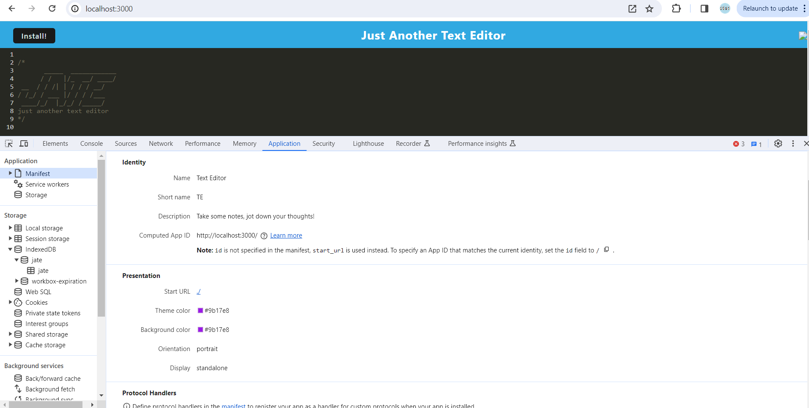
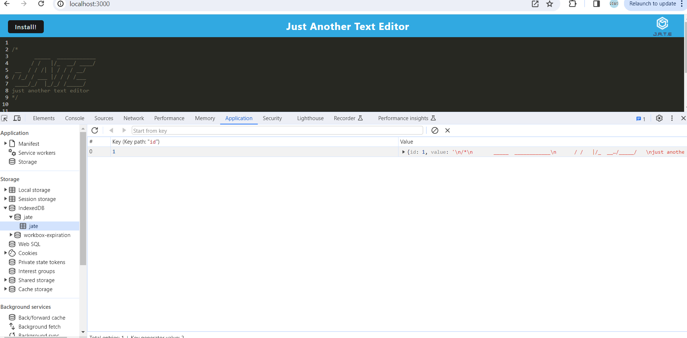
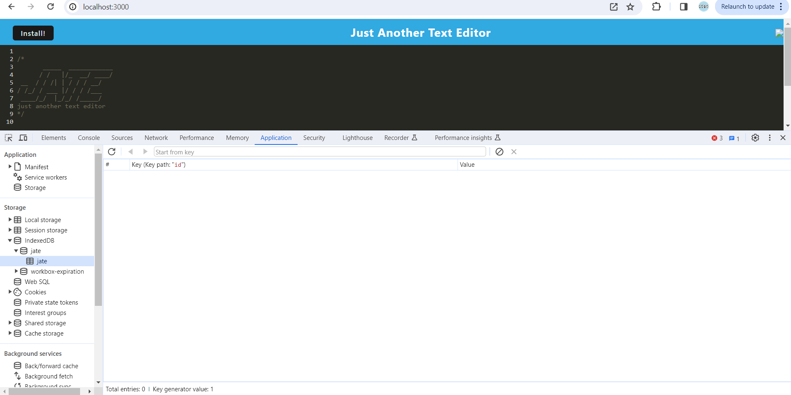

  # Text Editor 

  ## Description
  This repository contains code that builds a text editor application that runs in the browser as well as functions offline. Once loaded, user's can input text into the text editor, which will be saved and stored until the user removes it. The user can also download the application onto the desktop to use without an internet connection. 

  ## Table of Contents

  - [Installation](#installation)
  - [Usage](#usage)
  - [Contributing](#contributing)
  - [Tests](#tests)
  - [License](#license)
  - [Questions](#questions)
  - [Screenshots](#screenshots)
  - [Deployment](#deployment)

  ## Installation 
  To install the necessary dependencies, run "npm i"

  To build, run "npm run build"

  ## Usage 
  Editing text in a text editor

  ## Contributing 
  There are no contribution guidelines. 

  ## Tests 
  There are no tests. 

  ## License
  
  This repository has no license.

  ## Questions

  My GitHub: https://github.com/dfussell1

  For any questions or concerns regarding this repository or my work, please reach out to me at daltonfussell1@gmail.com

## Screenshots 
Manifest File: 

Service Worker: 

IndexedDB Storage: 

## Deployment 

https://text-editor-tua5.onrender.com/ 